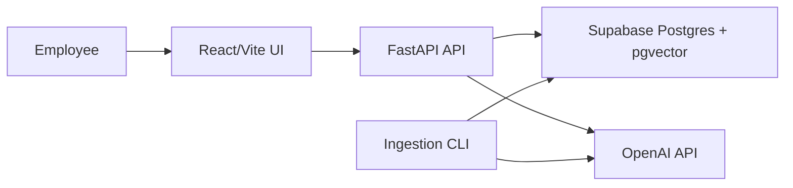

# Enterprise Knowledge Assistant

An enterprise knowledge assistant that answers employee questions from internal documents using Retrieval Augmented Generation (RAG). The project is built as a production-oriented assignment submission: it includes document ingestion, hybrid retrieval, grounded answer generation, source citations, feedback collection, evaluation metrics, and deployment configuration for Vercel + Railway + Supabase.

## Architecture Overview

The system has three main runtime parts:

- **Frontend:** React/Vite application deployed on Vercel. It provides the chat interface, Supabase sign-in, document upload, lightweight citation chips, answer quality metrics, and feedback buttons.
- **Backend:** FastAPI application deployed on Railway. It exposes `/ask`, `/documents`, `/upload`, `/feedback`, `/healthz`, `/readyz`, and admin-protected `/ingest`.
- **Database and vector store:** Supabase Postgres with pgvector. It stores documents, chunks, embeddings, conversations, messages, feedback, and evaluation runs.



Request flow:

1. Documents are ingested and split into page-aware chunks.
2. Chunks are embedded and indexed in Postgres/pgvector.
3. A user asks a natural-language question.
4. The backend retrieves relevant chunks using semantic and keyword signals.
5. The LLM generates an answer only from retrieved context.
6. The API returns answer, citations, live quality metrics, status, and latency.

## Setup Instructions

### Prerequisites

- Python 3.11+
- Node.js 20+
- OpenAI API key for full model-backed behavior
- Supabase Postgres with pgvector enabled for production deployment

The app can run locally without `OPENAI_API_KEY`; it uses deterministic fallback embeddings and fallback answer generation so the interface and API remain testable.

### Backend

From the repository root:

```powershell
Copy-Item .env.example .env
cd backend
python -m venv .venv
.\.venv\Scripts\Activate.ps1
pip install -e .[dev]
python -m app.cli ingest ..\data\sample
uvicorn app.main:app --reload --host 127.0.0.1 --port 8000
```

Backend URLs:

- API docs: `http://127.0.0.1:8000/docs`
- Readiness: `http://127.0.0.1:8000/readyz`

### Frontend

In another terminal:

```powershell
cd frontend
npm install
npm run dev -- --host 127.0.0.1
```

Open:

```text
http://127.0.0.1:5173
```

### Environment Variables

Backend:

```env
DATABASE_URL=
OPENAI_API_KEY=
FRONTEND_ORIGIN=
FRONTEND_ORIGINS=
FRONTEND_ORIGIN_REGEX=https://enterprise-knowledge-assis[a-z0-9-]*\.vercel\.app
ADMIN_API_KEY=
GEN_MODEL=gpt-5.5
UTILITY_MODEL=gpt-5.4-mini
EMBED_MODEL=text-embedding-3-large
EMBED_DIMS=3072
MAX_UPLOAD_MB=10
# Per-user auth (off by default). When true, all data is scoped to the Supabase user.
REQUIRE_AUTH=false
SUPABASE_URL=
SUPABASE_JWKS_URL=
SUPABASE_JWT_SECRET=
SUPABASE_JWT_AUDIENCE=authenticated
```

Frontend:

```env
VITE_API_BASE_URL=
# Optional: set both to require sign-in and give each user a private document space.
VITE_SUPABASE_URL=
VITE_SUPABASE_ANON_KEY=
```

### Deployment

Backend deployment target: Railway. Database target: Supabase Postgres + pgvector.

1. Create a Supabase project.
2. In Supabase, enable the `vector` extension from **Database -> Extensions**.
3. Copy the Supabase Postgres connection string. Prefer **Direct connection** for migrations or **Session Pooler** if direct networking is unavailable. Include `sslmode=require`.
4. Create a Railway project for the FastAPI backend.
5. Deploy from GitHub using `railway.json`.
6. Set Railway `DATABASE_URL` to the Supabase connection string.
7. Set Railway `FRONTEND_ORIGIN` to the production Vercel URL. Keep `FRONTEND_ORIGIN_REGEX=https://enterprise-knowledge-assis[a-z0-9-]*\.vercel\.app` so Vercel preview deployments can call the API during testing.
8. Apply the schema migrations against the deployed database: `alembic upgrade head` (adds the `owner_id` columns used for per-user isolation).
9. Run admin ingestion once to seed the shared sample corpus (`owner_id = public-seed`).

To enable per-user auth (optional): set `REQUIRE_AUTH=true` and `SUPABASE_URL` or `SUPABASE_JWKS_URL` on Railway for modern Supabase ES256 tokens. `SUPABASE_JWT_SECRET` remains supported as a legacy HS256 fallback. Set `VITE_SUPABASE_URL` + `VITE_SUPABASE_ANON_KEY` on Vercel. With auth off, the app runs as a single shared pool exactly as the MVP did.

Frontend deployment target: Vercel.

1. Create a Vercel project with root directory `frontend`.
2. Set `VITE_API_BASE_URL` to the Railway backend URL.
3. To require sign-in, set `VITE_SUPABASE_URL` and `VITE_SUPABASE_ANON_KEY`.
4. Deploy with the default Vite build command.

## Technology Choices

| Area | Choice | Reason |
|---|---|---|
| Backend | FastAPI | Fast, typed, simple API development with strong OpenAPI docs. |
| Frontend | React + Vite | Polished demo UI with lightweight build and clean Vercel deployment. |
| Database | Supabase Postgres | Managed Postgres with dashboard, SQL editor, future Auth/Storage path, and pgvector support. |
| Vector search | Supabase pgvector | Avoids a separate vector database while still supporting semantic search. |
| Vector index | `halfvec(3072)` + HNSW | Fits 3072-dimension embeddings and supports efficient cosine search in Postgres. |
| Embeddings | `text-embedding-3-large` | Strong semantic retrieval quality; dimensions are configurable. |
| LLM | Env-configurable OpenAI model | Keeps model choice swappable without changing code. |
| Evaluation | Custom in-process eval runner | Measures retrieval, citation, abstention, and answer quality without needing a live server. |

## Design Decisions

### RAG Architecture

The backend uses a deterministic RAG pipeline rather than an open-ended agent:

```text
question -> optional rewrite -> retrieve -> fuse -> rerank -> pack context -> generate answer
```

This is easier to test, explain, and control. Agents are flexible, but for an enterprise knowledge assistant the priority is grounded, auditable answers.

### Document Ingestion

The ingestion CLI supports PDF, Markdown, text, and DOCX. Each file is checksummed so unchanged documents are skipped on re-ingestion. This prevents duplicate chunks and makes production indexing repeatable.

### Chunking Approach

Chunks are page-aware and section-aware. A chunk does not cross a page boundary, which keeps source citations accurate. The chunker uses a target size with overlap so each chunk has enough context without becoming too broad.

Why not simple fixed-size chunking:

- It can split important sections in awkward places.
- It can make citations less accurate.
- It can reduce retrieval relevance.

### Retrieval Strategy

The system uses hybrid retrieval:

- Dense semantic retrieval finds meaning-based matches.
- Keyword/full-text retrieval catches exact policy names, acronyms, product names, and numbers.
- Reciprocal Rank Fusion combines both rankings.
- Optional LLM reranking improves final candidate order.
- Optional multi-query / RAG-Fusion (`ENABLE_MULTI_QUERY`, off by default) expands the question into several phrasings, retrieves for each, and fuses the results — a recall lever for large per-user corpora, included as an ablation row so its cost/benefit is measurable.

This gives better relevance than dense-only or keyword-only search.

### Prompt Design

The prompt instructs the model to answer only from supplied context and abstain when evidence is insufficient. The API also returns `status: "insufficient_context"` when retrieval confidence is weak.

This prevents unsupported answers and makes failure cases explicit instead of hiding them behind vague responses.

### Source Citation

Citations come from retrieval metadata, not from the LLM inventing filenames or page numbers. The UI shows compact document-name citations, and clicking a citation opens the indexed-text artifact for that document. Each source still carries stable document/chunk IDs so the artifact can highlight the referenced section.

The live answer metrics are product-safe evidence signals:

- confidence: bounded heuristic, not a calibrated probability
- groundedness: share of answer claims mapped to retrieved chunks
- citation count
- answer status
- latency

Raw retrieval scores are intentionally not shown in the UI because they are debug values and are easy to misinterpret.

### Conversation Memory

The backend stores conversations and messages. Follow-up questions can be rewritten using recent conversation history, but final answers still depend on retrieved document evidence.

### Authentication & per-user isolation

The app supports per-user data isolation backed by Supabase Auth:

- Admin bulk ingestion requires `x-admin-api-key` and seeds the shared sample corpus.
- When `REQUIRE_AUTH=true`, `/ask`, `/documents`, `/upload`, and `/feedback` require a valid Supabase JWT. The backend verifies modern Supabase ES256 tokens through `SUPABASE_URL`/`SUPABASE_JWKS_URL`, with `SUPABASE_JWT_SECRET` retained only as the legacy HS256 fallback. Reads include the shared sample corpus (`public-seed`) plus the current user's uploads; writes stay scoped to that user's id (`sub`). Retrieval SQL filters on this readable owner set, so one user's question can use the bundled demo corpus but can never surface another user's private chunks (see `backend/tests/test_isolation.py`).
- When `REQUIRE_AUTH=false` (default), all data belongs to a single seed user and the app behaves like the original single-pool MVP.

Authenticated users upload their own documents via `POST /upload` (PDF/Markdown/text/DOCX). The document is created immediately as `processing` and embedded in a background task, so large files do not block the request; the UI polls `/documents` until the status flips to `indexed`.

Role-based access control (RBAC) and org-level (vs. per-user) tenancy are left as future work.

## Evaluation

The evaluation runner is `evals/run_eval.py`.

It uses a labelled dataset covering:

- direct factual questions
- keyword-heavy questions
- ambiguous questions
- multi-document questions
- unanswerable questions

Metrics:

- answer accuracy
- document Recall@5
- page Recall@5
- MRR
- abstention accuracy
- latency

These are offline correctness evals for the labelled sample corpus. They are valid because `evals/dataset.jsonl` contains expected answer snippets and gold source documents/pages. For arbitrary user-uploaded documents, the app cannot honestly compute true correctness without labelled questions and expected answers. In the live chat UI, uploaded documents use confidence, groundedness, citations, status, latency, and user feedback as quality signals.

Future user-document correctness evals would require an owner-scoped labelled eval set, for example:

```json
{
  "question": "What is the PTO policy?",
  "expected_answer_contains": ["24 paid leaves"],
  "gold_sources": [{ "document": "HR.md", "page": 1 }]
}
```

Those eval runs should be stored in `eval_runs` and reported in an admin/evaluation view, not as per-answer live correctness.

Ablation results from the current sample corpus:

| Config | Answer acc | Doc Recall@5 | Page Recall@5 | MRR | Abstention | Latency (ms) |
|---|---:|---:|---:|---:|---:|---:|
| dense_only | 0.81 | 1.00 | 1.00 | 0.98 | 1.00 | 2425 |
| +hybrid_rrf | 0.92 | 1.00 | 1.00 | 0.98 | 1.00 | 2605 |
| +rerank | 0.89 | 1.00 | 1.00 | 1.00 | 1.00 | 3096 |

What improved:

- Hybrid retrieval gave the largest answer-quality lift.
- Reranking improved ordering quality, shown by MRR reaching 1.00.
- Page-aware chunking kept page citation accuracy at 1.00.
- Abstention worked correctly on out-of-scope questions.

Run evaluation:

```powershell
python evals\run_eval.py
```

Outputs:

- `evals/reports/ablation.json`
- `evals/reports/latest.json`
- `evals/reports/ablation.md`

## Limitations

- OCR is not implemented; scanned PDFs require future OCR support.
- The sample corpus is synthetic and smaller than a real enterprise corpus.
- Per-user isolation is implemented via Supabase Auth, but RBAC and org-level (multi-tenant) authorization are not.
- Background upload indexing uses FastAPI background tasks (in-process); a high-volume deployment would need a dedicated queue/worker.
- Conversations and messages are not yet owner-scoped (documents and chunks are).
- Streaming responses are not implemented in the MVP.
- Redis caching is not implemented.
- Evaluation uses a labelled sample set; user-uploaded documents need their own labelled eval sets before true correctness can be reported.

## Future Improvements

- Add OCR for scanned PDFs.
- Move upload indexing to a dedicated queue/worker for large corpora.
- Add RBAC, org-level tenancy, and audit trails on top of the per-user auth.
- Scope conversations and messages to the owner.
- Enable multi-query / RAG-Fusion (already implemented behind `ENABLE_MULTI_QUERY`) once per-user corpora grow large enough to benefit.
- Add streaming responses through `/ask/stream`.
- Add Redis caching for repeated questions and embeddings.
- Add observability dashboards for latency, cost, token usage, and answer quality.
- Move to a dedicated vector database such as Qdrant, Pinecone, or Weaviate if the corpus grows to millions of chunks.
- Add owner-scoped labelled eval sets, scheduled evaluation runs, and feedback-driven improvement loops.

## Demo Script

1. Show indexed documents in the left panel.
2. Ask: "What is the employee paid leave policy?"
3. Expand the HR source citation.
4. Ask: "What should API clients do for 429 responses?"
5. Ask an unsupported question like "What is the lunch menu tomorrow?"
6. Show the `insufficient_context` response.
7. Submit feedback.
8. Explain the flow: ingestion, chunking, hybrid retrieval, reranking, grounded generation, citations, and evaluation.
