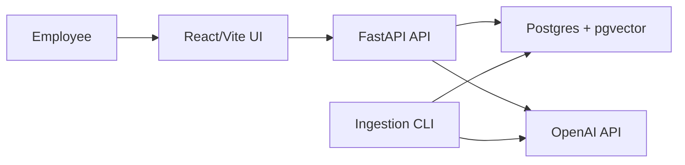

# Enterprise Knowledge Assistant

An enterprise knowledge assistant that answers employee questions from internal documents using Retrieval Augmented Generation (RAG). The project is built as a production-oriented assignment submission: it includes document ingestion, hybrid retrieval, grounded answer generation, source citations, feedback collection, evaluation metrics, and deployment configuration for Vercel + Railway.

## Architecture Overview

The system has three main runtime parts:

- **Frontend:** React/Vite application deployed on Vercel. It provides the chat interface, document status panel, citation cards, confidence/status indicators, and feedback buttons.
- **Backend:** FastAPI application deployed on Railway. It exposes `/ask`, `/documents`, `/feedback`, `/healthz`, `/readyz`, and admin-protected `/ingest`.
- **Database and vector store:** Railway Postgres with pgvector. It stores documents, chunks, embeddings, conversations, messages, feedback, and evaluation runs.



Request flow:

1. Documents are ingested and split into page-aware chunks.
2. Chunks are embedded and indexed in Postgres/pgvector.
3. A user asks a natural-language question.
4. The backend retrieves relevant chunks using semantic and keyword signals.
5. The LLM generates an answer only from retrieved context.
6. The API returns answer, confidence, status, and source citations.

## Setup Instructions

### Prerequisites

- Python 3.11+
- Node.js 20+
- OpenAI API key for full model-backed behavior
- Railway Postgres + pgvector for production deployment

The app can run locally without `OPENAI_API_KEY`; it uses deterministic fallback embeddings and fallback answer generation so the interface and API remain testable.

### Backend

From the repository root:

```powershell
Copy-Item .env.example .env
cd backend
python -m venv .venv
.\.venv\Scripts\Activate.ps1
pip install -e .[dev]
python -m app.cli ingest ..\data\sample
uvicorn app.main:app --reload --host 127.0.0.1 --port 8000
```

Backend URLs:

- API docs: `http://127.0.0.1:8000/docs`
- Readiness: `http://127.0.0.1:8000/readyz`

### Frontend

In another terminal:

```powershell
cd frontend
npm install
npm run dev -- --host 127.0.0.1
```

Open:

```text
http://127.0.0.1:5173
```

### Environment Variables

Backend:

```env
DATABASE_URL=
OPENAI_API_KEY=
FRONTEND_ORIGIN=
ADMIN_API_KEY=
GEN_MODEL=gpt-5.5
UTILITY_MODEL=gpt-5.4-mini
EMBED_MODEL=text-embedding-3-large
EMBED_DIMS=3072
REQUIRE_AUTH=false
API_AUTH_TOKEN=
```

Frontend:

```env
VITE_API_BASE_URL=
VITE_API_AUTH_TOKEN=
```

### Deployment

Backend deployment target: Railway.

1. Create a Railway project.
2. Add Railway Postgres with pgvector support.
3. Configure backend environment variables.
4. Deploy from GitHub using `railway.json`.
5. Run ingestion once against the deployed database.

Frontend deployment target: Vercel.

1. Create a Vercel project with root directory `frontend`.
2. Set `VITE_API_BASE_URL` to the Railway backend URL.
3. If auth is enabled, set `VITE_API_AUTH_TOKEN`.
4. Deploy with the default Vite build command.

## Technology Choices

| Area | Choice | Reason |
|---|---|---|
| Backend | FastAPI | Fast, typed, simple API development with strong OpenAPI docs. |
| Frontend | React + Vite | Polished demo UI with lightweight build and clean Vercel deployment. |
| Database | Railway Postgres | One production database for documents, chat state, feedback, and eval records. |
| Vector search | pgvector | Avoids a separate vector database while still supporting semantic search. |
| Vector index | `halfvec(3072)` + HNSW | Fits 3072-dimension embeddings and supports efficient cosine search in Postgres. |
| Embeddings | `text-embedding-3-large` | Strong semantic retrieval quality; dimensions are configurable. |
| LLM | Env-configurable OpenAI model | Keeps model choice swappable without changing code. |
| Evaluation | Custom in-process eval runner | Measures retrieval, citation, abstention, and answer quality without needing a live server. |

## Design Decisions

### RAG Architecture

The backend uses a deterministic RAG pipeline rather than an open-ended agent:

```text
question -> optional rewrite -> retrieve -> fuse -> rerank -> pack context -> generate answer
```

This is easier to test, explain, and control. Agents are flexible, but for an enterprise knowledge assistant the priority is grounded, auditable answers.

### Document Ingestion

The ingestion CLI supports PDF, Markdown, text, and DOCX. Each file is checksummed so unchanged documents are skipped on re-ingestion. This prevents duplicate chunks and makes production indexing repeatable.

### Chunking Approach

Chunks are page-aware and section-aware. A chunk does not cross a page boundary, which keeps source citations accurate. The chunker uses a target size with overlap so each chunk has enough context without becoming too broad.

Why not simple fixed-size chunking:

- It can split important sections in awkward places.
- It can make citations less accurate.
- It can reduce retrieval relevance.

### Retrieval Strategy

The system uses hybrid retrieval:

- Dense semantic retrieval finds meaning-based matches.
- Keyword/full-text retrieval catches exact policy names, acronyms, product names, and numbers.
- Reciprocal Rank Fusion combines both rankings.
- Optional LLM reranking improves final candidate order.

This gives better relevance than dense-only or keyword-only search.

### Prompt Design

The prompt instructs the model to answer only from supplied context and abstain when evidence is insufficient. The API also returns `status: "insufficient_context"` when retrieval confidence is weak.

This prevents unsupported answers and makes failure cases explicit instead of hiding them behind vague responses.

### Source Citation

Citations come from retrieval metadata, not from the LLM inventing filenames or page numbers. Each source includes:

- document name
- page
- snippet
- relevance score

### Conversation Memory

The backend stores conversations and messages. Follow-up questions can be rewritten using recent conversation history, but final answers still depend on retrieved document evidence.

### Authentication

Two levels are implemented:

- Admin ingestion requires `x-admin-api-key`.
- Optional bearer auth can protect `/ask` and `/feedback` with `REQUIRE_AUTH=true` and `API_AUTH_TOKEN`.

Full multi-user login and RBAC are left as future work.

## Evaluation

The evaluation runner is `evals/run_eval.py`.

It uses a labelled dataset covering:

- direct factual questions
- keyword-heavy questions
- ambiguous questions
- multi-document questions
- unanswerable questions

Metrics:

- answer accuracy
- document Recall@5
- page Recall@5
- MRR
- abstention accuracy
- latency

Ablation results from the current sample corpus:

| Config | Answer acc | Doc Recall@5 | Page Recall@5 | MRR | Abstention | Latency (ms) |
|---|---:|---:|---:|---:|---:|---:|
| dense_only | 0.81 | 1.00 | 1.00 | 0.98 | 1.00 | 2425 |
| +hybrid_rrf | 0.92 | 1.00 | 1.00 | 0.98 | 1.00 | 2605 |
| +rerank | 0.89 | 1.00 | 1.00 | 1.00 | 1.00 | 3096 |

What improved:

- Hybrid retrieval gave the largest answer-quality lift.
- Reranking improved ordering quality, shown by MRR reaching 1.00.
- Page-aware chunking kept page citation accuracy at 1.00.
- Abstention worked correctly on out-of-scope questions.

Run evaluation:

```powershell
python evals\run_eval.py
```

Outputs:

- `evals/reports/ablation.json`
- `evals/reports/latest.json`
- `evals/reports/ablation.md`

## Limitations

- OCR is not implemented; scanned PDFs require future OCR support.
- The sample corpus is synthetic and smaller than a real enterprise corpus.
- Full user authentication, RBAC, and multi-tenant authorization are not implemented.
- Streaming responses are not implemented in the MVP.
- Async/background ingestion is not implemented.
- Redis caching is not implemented.
- Evaluation uses a labelled sample set; a production system would need ongoing evals and human review.

## Future Improvements

- Add OCR for scanned PDFs.
- Add background ingestion with a queue for large corpora.
- Add user login, RBAC, and audit trails.
- Add streaming responses through `/ask/stream`.
- Add Redis caching for repeated questions and embeddings.
- Add admin upload UI for documents.
- Add observability dashboards for latency, cost, token usage, and answer quality.
- Move to a dedicated vector database such as Qdrant, Pinecone, or Weaviate if the corpus grows to millions of chunks.
- Add scheduled evaluation runs and feedback-driven improvement loops.

## Demo Script

1. Show indexed documents in the left panel.
2. Ask: "What is the employee paid leave policy?"
3. Expand the HR source citation.
4. Ask: "What should API clients do for 429 responses?"
5. Ask an unsupported question like "What is the lunch menu tomorrow?"
6. Show the `insufficient_context` response.
7. Submit feedback.
8. Explain the flow: ingestion, chunking, hybrid retrieval, reranking, grounded generation, citations, and evaluation.
