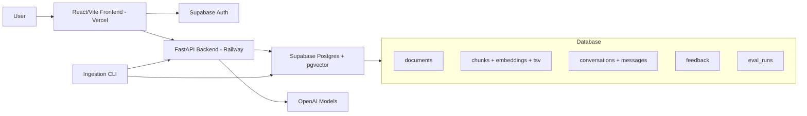

# Enterprise Knowledge Assistant

A production-shaped Retrieval Augmented Generation (RAG) assistant for answering questions from enterprise documents. The system ingests internal knowledge, indexes it with hybrid semantic + keyword retrieval, generates grounded LLM answers, shows lightweight source citations, collects feedback, supports Supabase authentication, and is deployed with a Vercel frontend, Railway backend, and Supabase Postgres + pgvector database.

This project is built for the AI Engineer assignment requirements: document ingestion, knowledge indexing, retrieval, LLM answer generation, citations, user interface, engineering quality, evaluation, scalability, and deployment.

## What This Demonstrates

| Requirement | Implementation |
|---|---|
| Document ingestion and processing | PDF, Markdown, TXT, and DOCX loaders with checksum-based idempotency |
| Knowledge indexing and retrieval | Supabase Postgres + pgvector, page-aware chunks, full-text search, dense search |
| LLM-based response generation | Strict grounded prompt with insufficient-context fallback |
| Source citation | Compact document citations with artifact viewer and highlighted referenced chunk |
| User interaction interface | React/Vite chat UI, upload flow, metrics, citations, feedback |
| Engineering best practices | Typed FastAPI API, SQLAlchemy models, Alembic migrations, tests, structured logging |
| Scalability considerations | Stateless API, indexed vector search, upload background task, clear worker/vector DB upgrade path |
| Deployment | Vercel frontend, Railway backend, Supabase Postgres + pgvector |

## Bonus Features

Implemented optional features:

- Conversation memory through persisted conversations and follow-up query rewriting.
- Hybrid search combining keyword/full-text retrieval and semantic vector retrieval.
- Query rewriting for follow-up questions.
- LLM reranking of retrieved chunks.
- Multi-document reasoning through context packing across top evidence chunks.
- User feedback collection with thumbs up/down persisted in the database.
- Evaluation metrics and ablation reports in `evals/`.
- Supabase authentication with per-user document isolation.
- Live deployment configuration for Vercel, Railway, and Supabase.
- Optional multi-query / RAG-Fusion behind `ENABLE_MULTI_QUERY`.

## Architecture Overview



Runtime components:

- **Frontend:** React/Vite application for sign-in, document upload, chat, answer metrics, compact citations, artifact viewing, and feedback.
- **Backend:** FastAPI service for ingestion, retrieval, generation, feedback, health checks, readiness checks, and auth-scoped access control.
- **Database/vector store:** Supabase Postgres with pgvector. It stores application data and vector indexes in one managed database.
- **LLM services:** OpenAI chat models for generation, utility tasks, rewriting, reranking, and embeddings.

## Data Flow

### Ingestion

1. Admin bulk ingestion loads the bundled sample corpus from `data/sample`.
2. Authenticated users can upload their own PDF, Markdown, TXT, or DOCX files.
3. Each document is checksummed, so repeated ingestion skips unchanged content.
4. Text is parsed while preserving page and section metadata.
5. Content is split into page-aware chunks so citations can point back to a stable page/section.
6. Chunks are embedded in batches.
7. Metadata, text, embeddings, and full-text search vectors are stored in Postgres.
8. pgvector HNSW indexes support fast semantic retrieval.

### Question Answering

1. The user asks a question from the frontend.
2. The frontend sends the Supabase access token to `POST /ask`.
3. The backend scopes retrieval to the shared sample corpus plus the current user's uploaded documents.
4. Follow-up questions can be rewritten into standalone search queries using recent conversation history.
5. Dense vector retrieval and Postgres full-text retrieval run in parallel.
6. Reciprocal Rank Fusion combines semantic and keyword results.
7. The utility model can rerank the strongest candidates.
8. The generation model receives only retrieved context and must cite chunk IDs.
9. The API returns the answer, citations, confidence, groundedness, status, and latency.
10. The user can open a citation artifact or submit thumbs up/down feedback.

## Repository Layout

```text
backend/              FastAPI app, SQLAlchemy models, Alembic migrations, RAG pipeline
frontend/             React/Vite user interface
data/sample/          12 bundled synthetic enterprise documents
docs/system-design.md 1-2 page system design document
evals/                Labelled eval dataset, runner, and reports
.env.example          Local and deployment environment template
railway.json          Railway backend deployment config
nixpacks.toml         Railway/Nixpacks Python build config
```

Bundled sample corpus:

- `Compliance_Vendor_Risk.md`
- `Customer_FAQ_Billing.md`
- `Customer_FAQ_Support.md`
- `Employee_Onboarding_Process.md`
- `Engineering_Incident_Response.md`
- `Engineering_Release_Process.md`
- `HR_Policy_Handbook.md`
- `IT_Access_Management.md`
- `Product_Atlas_Admin_Guide.md`
- `Product_Nova_API_Reference.md`
- `Sales_Process_Playbook.md`
- `Security_Data_Classification.md`

## How To Run The Application

### Prerequisites

- Python 3.11+
- Node.js 20+
- Supabase Postgres with pgvector for production
- OpenAI API key for model-backed behavior

The app can run locally without an OpenAI key by using deterministic fallback embeddings and fallback answer generation. This keeps the UI, API, parsing, retrieval flow, and tests runnable even when model credentials are absent.

### Backend

From the repository root:

```powershell
Copy-Item .env.example .env
cd backend
python -m venv .venv
.\.venv\Scripts\Activate.ps1
pip install -e .[dev]
python -m app.cli ingest ..\data\sample
uvicorn app.main:app --reload --host 127.0.0.1 --port 8000
```

Useful backend URLs:

- API docs: `http://127.0.0.1:8000/docs`
- Health: `http://127.0.0.1:8000/healthz`
- Readiness: `http://127.0.0.1:8000/readyz`

### Frontend

In a second terminal:

```powershell
cd frontend
npm install
npm run dev -- --host 127.0.0.1
```

Open:

```text
http://127.0.0.1:5173
```

### Run Tests

```powershell
cd backend
.\.venv\Scripts\python.exe -m pytest tests
.\.venv\Scripts\python.exe -m ruff check .

cd ..\frontend
npm run build
```

### Run Evaluations

```powershell
python evals\run_eval.py
```

Generated reports:

- `evals/reports/latest.json`
- `evals/reports/ablation.json`
- `evals/reports/ablation.md`

## Environment Variables

Backend:

```env
DATABASE_URL=
OPENAI_API_KEY=
FRONTEND_ORIGIN=http://localhost:5173
FRONTEND_ORIGINS=
FRONTEND_ORIGIN_REGEX=https://enterprise-knowledge-assis[a-z0-9-]*\.vercel\.app
ADMIN_API_KEY=change-me

GEN_MODEL=gpt-5.5
UTILITY_MODEL=gpt-5.4-mini
EMBED_MODEL=text-embedding-3-large
EMBED_DIMS=3072

RATE_LIMIT=20/minute
MAX_QUESTION_CHARS=1200
MAX_UPLOAD_MB=10
RETRIEVAL_TOP_K=8
RERANK_TOP_K=6
RETRIEVAL_THRESHOLD=0.08

ENABLE_QUERY_REWRITE=true
ENABLE_LLM_RERANK=true
ENABLE_HYBRID=true
ENABLE_GROUNDEDNESS_GATE=true
ENABLE_MULTI_QUERY=false
MULTI_QUERY_COUNT=3

REQUIRE_AUTH=false
SUPABASE_URL=
SUPABASE_JWKS_URL=
SUPABASE_JWT_SECRET=
SUPABASE_JWT_AUDIENCE=authenticated
```

Frontend:

```env
VITE_API_BASE_URL=http://127.0.0.1:8000
VITE_SUPABASE_URL=
VITE_SUPABASE_ANON_KEY=
```

## Deployment

### Supabase

1. Create a Supabase project.
2. Enable the `vector` extension from **Database -> Extensions**.
3. Copy the Postgres connection string and include `sslmode=require`.
4. Configure Supabase Auth redirect URLs for local and production frontend URLs.
5. Keep the database connection string and service credentials out of the repository.

### Railway Backend

1. Create a Railway project from this GitHub repository.
2. Use the root project with `railway.json`.
3. Set backend environment variables:
   - `DATABASE_URL`
   - `OPENAI_API_KEY`
   - `ADMIN_API_KEY`
   - `FRONTEND_ORIGIN`
   - `FRONTEND_ORIGIN_REGEX`
   - `REQUIRE_AUTH=true`
   - `SUPABASE_URL` or `SUPABASE_JWKS_URL`
4. Railway start command runs migrations and starts Uvicorn:

```text
cd backend && python -m alembic upgrade head && python -m uvicorn app.main:app --host 0.0.0.0 --port $PORT --proxy-headers
```

5. Run admin ingestion once to seed the shared sample corpus under `public-seed`.

### Vercel Frontend

1. Create a Vercel project from the repository.
2. Set root directory to `frontend`.
3. Set:
   - `VITE_API_BASE_URL=<Railway backend URL>`
   - `VITE_SUPABASE_URL=<Supabase project URL>`
   - `VITE_SUPABASE_ANON_KEY=<Supabase anon key>`
4. Build command: `npm run build`
5. Output directory: `dist`

## Public API

| Method | Route | Purpose |
|---|---|---|
| `POST` | `/ask` | Answer a question using retrieved document evidence |
| `GET` | `/documents` | List shared sample documents plus current user's uploads |
| `GET` | `/documents/{document_id}/artifact` | Return indexed chunks for the citation artifact viewer |
| `POST` | `/upload` | Upload a user document for background indexing |
| `POST` | `/feedback` | Persist thumbs up/down answer feedback |
| `GET` | `/healthz` | Liveness check |
| `GET` | `/readyz` | DB/model/readiness check |
| `POST` | `/ingest` | Admin-protected bulk ingestion |
| `POST` | `/ask/stream` | Reserved P1 streaming endpoint |

`POST /ask` response shape:

```json
{
  "answer": "...",
  "sources": [
    {
      "document_id": "...",
      "chunk_id": "...",
      "document": "HR_Policy_Handbook.md",
      "page": 1,
      "section_title": "Paid Leave",
      "snippet": "...",
      "score": 0.91
    }
  ],
  "confidence": 0.82,
  "status": "answered",
  "conversation_id": "...",
  "message_id": "...",
  "latency_ms": 1240,
  "metrics": {
    "confidence": 0.82,
    "groundedness": 1.0,
    "citation_count": 2,
    "status": "answered",
    "latency_ms": 1240
  }
}
```

## Technology Choices

| Area | Choice | Why |
|---|---|---|
| Frontend | React + Vite | Fast local development, simple Vercel deployment, flexible custom UI |
| Backend | FastAPI | Typed request/response models, OpenAPI docs, strong Python ecosystem |
| Database | Supabase Postgres | Managed Postgres, dashboard, auth integration, SQL editor |
| Vector search | pgvector | Avoids a separate vector database for this scale |
| Vector type | `halfvec(3072)` + HNSW | Supports 3072-dimensional embeddings efficiently in pgvector |
| Embeddings | `text-embedding-3-large` | Strong semantic retrieval quality, configurable dimensions |
| LLMs | Env-configurable OpenAI models | Easy quality/cost switching without code changes |
| Auth | Supabase Auth | Hosted email/password auth and JWT verification |
| Deployment | Vercel + Railway + Supabase | Source-based deployment without Docker overhead |
| Evaluation | Custom eval runner | Direct measurement of retrieval, abstention, citation, and answer quality |

## Technical Decisions

### RAG Over Agentic Browsing

The backend uses a controlled RAG pipeline:

```text
question -> rewrite -> retrieve -> fuse -> rerank -> generate -> cite -> evaluate
```

This is more auditable than an open-ended agent. For enterprise knowledge, the key requirement is not tool autonomy; it is grounded, explainable answers from approved documents.

### Page-Aware Chunking

Chunks preserve document, page, and section metadata and do not intentionally cross page boundaries. This improves citation quality because a returned source can point to the exact indexed section used in the answer.

### Hybrid Retrieval

Dense retrieval handles semantic matches. Keyword retrieval handles exact terms like product names, policy labels, acronyms, and numbers. Reciprocal Rank Fusion combines both, and LLM reranking improves the final evidence order.

### Grounded Generation

The model receives only retrieved context and is instructed to cite chunk IDs. If evidence is weak, the backend returns `insufficient_context` instead of making the model guess. The UI shows evidence-derived metrics: confidence, groundedness, citation count, answer status, and latency.

### Lightweight Citations

The answer area stays clean. It shows compact document-name citations instead of long chunks. Clicking a citation opens a right-side indexed-text artifact panel and highlights the referenced chunk.

### Authentication And Data Isolation

With `REQUIRE_AUTH=true`, Supabase JWTs are verified by the backend. Reads include:

- shared sample corpus owned by `public-seed`
- current user's uploaded documents

Document uploads are scoped to the authenticated user's `sub`. Retrieval filters by the readable owner set, so all users can demo the bundled 12 documents while private uploads remain isolated. Feedback submission also goes through the auth dependency when auth is enabled and is linked to the assistant message it rates.

## Evaluation Approach

The eval dataset covers:

- direct fact questions
- keyword-heavy questions
- ambiguous questions
- unanswerable questions
- follow-up questions
- multi-document reasoning questions

Metrics reported:

- answer accuracy
- document Recall@5
- page Recall@5
- MRR
- abstention accuracy
- latency

Current ablation results from the sample corpus:

| Config | Answer acc | Doc Recall@5 | Page Recall@5 | MRR | Abstention | Latency (ms) |
|---|---:|---:|---:|---:|---:|---:|
| dense_only | 0.81 | 1.00 | 1.00 | 0.98 | 1.00 | 2425 |
| +hybrid_rrf | 0.92 | 1.00 | 1.00 | 0.98 | 1.00 | 2605 |
| +rerank | 0.89 | 1.00 | 1.00 | 1.00 | 1.00 | 3096 |

Correctness is reported only in offline evals where labelled expected answers and gold sources exist. For arbitrary user uploads, the live UI does not claim correctness because there is no ground truth. Instead it reports confidence, groundedness, citations, latency, status, and feedback.

## Known Limitations

- OCR is not implemented; scanned PDFs need future OCR support.
- The bundled corpus is synthetic and smaller than a real enterprise corpus.
- Upload indexing currently uses FastAPI background tasks; high-volume production should use a queue and worker.
- Feedback is collected, but there is no admin analytics dashboard or owner-scoped feedback reporting yet.
- User-uploaded document correctness cannot be measured automatically without labelled eval questions.
- Streaming responses are reserved for P1 through `/ask/stream`.
- RBAC, organization-level tenancy, audit logs, and admin roles are future work.
- Redis caching and cost/token observability are not yet implemented.

## Future Improvements

- Add OCR for scanned PDFs.
- Move ingestion to a dedicated queue/worker for large uploads.
- Add organization/team workspaces with RBAC and audit logs.
- Add owner-scoped labelled eval-set upload and scheduled evaluation runs.
- Add feedback analytics and route low-rated answers into an improvement workflow.
- Add streaming responses through `/ask/stream`.
- Add Redis caching for repeated queries and expensive intermediate results.
- Add dashboards for latency, token usage, cost, retrieval quality, groundedness, and feedback trends.
- Move vector search to Qdrant, Pinecone, or Weaviate if the corpus reaches millions of chunks.

## Demo Script

Suggested 5-minute walkthrough:

1. Sign in with Supabase Auth.
2. Show the 12 shared indexed documents.
3. Ask: `What is the employee paid leave policy?`
4. Click the HR citation and show the artifact highlight.
5. Ask: `What should API clients do for 429 responses?`
6. Upload a small user document and show that it becomes indexed.
7. Ask a question from the uploaded document.
8. Ask an unsupported question and show the `Needs more context` answer.
9. Submit thumbs up/down feedback.
10. Explain the pipeline: ingestion, chunking, hybrid retrieval, reranking, grounded generation, citations, evals, and deployment.

## System Design Document

The 1-2 page system design document is available at:

```text
docs/system-design.md
```
