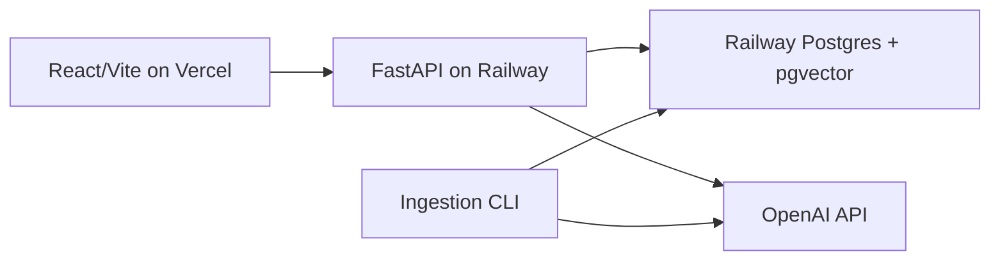

# Enterprise Knowledge Assistant - System Design

## Architecture

The assistant is a production-shaped Retrieval Augmented Generation system. The frontend is a React/Vite application deployed on Vercel. The backend is a stateless FastAPI service deployed on Railway. Railway Postgres with pgvector stores documents, chunks, embeddings, conversations, messages, feedback, and evaluation runs.

## Data Flow

Documents are loaded from `data/sample` or a replacement corpus, parsed page by page, split into page-anchored, section-aware chunks (a chunk never spans a page, which keeps citations page-accurate), embedded, and stored with checksum-based idempotency. At query time, the API rewrites follow-up questions when needed, retrieves dense and keyword candidates, fuses rankings with reciprocal rank fusion, reranks candidates, packs context from multiple documents, and generates a grounded answer with citations.

The assistant abstains when retrieval confidence is weak or when the groundedness gate cannot map claims back to retrieved chunks. Confidence is a documented heuristic combining retrieval strength and groundedness, not a true probability.

## Scalability

The API is stateless and can scale horizontally on Railway. Postgres owns durable state. pgvector is appropriate for the assignment-scale corpus and supports HNSW indexing with `halfvec(3072)`. At much larger scale, the vector store can be replaced by Qdrant, Pinecone, or Weaviate while keeping the retrieval interface stable.

## Evaluation

A self-contained in-process runner (`evals/run_eval.py`) scores the pipeline over a 27-question labelled set covering direct, keyword, ambiguous, multi-document, and unanswerable questions. It reports answer accuracy, document and page Recall@5, MRR, abstention accuracy, and latency, and runs an ablation across `dense_only -> +hybrid_rrf -> +rerank`. On gpt-4.1-nano, hybrid retrieval raises answer accuracy from 0.81 to 0.92, re-ranking lifts MRR to 1.00, and page-accurate chunking yields Page Recall@5 = 1.00 with perfect abstention.

## Security And Operations

CORS is restricted to the Vercel origin. Public `/ask` requests are rate limited and length capped. Ingestion is protected by `ADMIN_API_KEY`, and optional bearer-token auth (`REQUIRE_AUTH` + `API_AUTH_TOKEN`) can gate `/ask` and `/feedback`. Secrets live only in Railway and Vercel environment variables. Health and readiness endpoints support deployment verification.

## Limitations

OCR, multi-tenant RBAC, async ingestion queues, Redis caching, and streaming answers are deliberate future work. The MVP focuses on accurate cited answers, measurable retrieval quality, and a deployable architecture.
