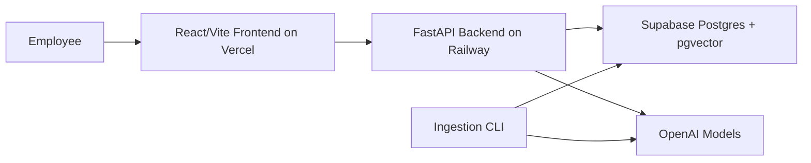

# Enterprise Knowledge Assistant - System Design

## High-Level Architecture

The Enterprise Knowledge Assistant is a Retrieval Augmented Generation (RAG) application for answering questions from internal company documents. It is designed as a deployable production-style system while keeping the implementation compact enough for an assignment.

Runtime architecture:

The frontend is a React/Vite app that provides the chat experience, document status panel, citation cards, confidence/status display, and user feedback controls. The backend is a stateless FastAPI service that owns ingestion, retrieval, answer generation, feedback, and health checks. Supabase Postgres with pgvector is the single durable store for documents, chunks, embeddings, conversations, messages, feedback, and evaluation results.

This architecture keeps deployment simple: Vercel hosts the frontend, Railway hosts the Python FastAPI backend, and Supabase provides managed Postgres plus pgvector. Docker is not required.

## Data Flow

### Ingestion Flow

1. Documents are placed in `data/sample` or another configured input folder.
2. The ingestion CLI loads supported files: PDF, Markdown, TXT, and DOCX.
3. Each document is checksummed to make ingestion idempotent.
4. Text is parsed with page metadata preserved.
5. Text is split into page-aware, section-aware chunks.
6. Each chunk is embedded with the configured embedding model.
7. Chunks, metadata, and embeddings are stored in Postgres.
8. In Postgres deployments, embeddings are indexed with pgvector using `halfvec(3072)` and HNSW.

The important design choice is page-aware chunking. Because chunks do not cross page boundaries, the system can return reliable document and page citations.

### Question Answering Flow

1. The user asks a question in the frontend.
2. The frontend calls `POST /ask`.
3. The backend optionally rewrites follow-up questions using recent conversation history.
4. The retrieval layer gets dense semantic candidates and keyword candidates.
5. Reciprocal Rank Fusion combines the two rankings.
6. The utility model can rerank the top candidates.
7. The backend packs the strongest chunks into the prompt.
8. The generation model answers only from the supplied context.
9. The backend returns answer, sources, confidence, status, conversation ID, and latency.
10. The user can submit feedback through `/feedback`.

If retrieval confidence is weak, the backend returns `status: "insufficient_context"` instead of forcing the model to guess.

## Component Explanation

### Frontend

The frontend is a React/Vite application. It is intentionally not a marketing page; the first screen is the actual assistant. It shows:

- indexed document list
- chat input
- answer card
- confidence badge
- source snippets
- useful/not useful feedback buttons

The frontend uses `VITE_API_BASE_URL` to call the deployed backend and can optionally send `VITE_API_AUTH_TOKEN` when bearer auth is enabled.

### Backend API

The FastAPI backend exposes:

- `POST /ask` for question answering
- `GET /documents` for indexed document status
- `POST /feedback` for answer feedback
- `GET /healthz` for liveness
- `GET /readyz` for database/model readiness
- `POST /ingest` for admin-protected ingestion

The API includes CORS controls, request length limits, rate limiting, optional bearer auth for query endpoints, and admin-key protection for ingestion.

### Ingestion Layer

The ingestion layer handles loading, chunking, embedding, and upserting documents. It keeps document checksum metadata so repeated runs skip unchanged files. This makes the indexing process predictable and safe to rerun.

### Retrieval Layer

The retrieval layer uses a hybrid strategy:

- semantic retrieval for meaning-based matches
- keyword/full-text retrieval for exact terms
- reciprocal rank fusion to combine results
- optional LLM reranking for better candidate ordering

This gives stronger relevance than dense-only or keyword-only retrieval.

### Generation Layer

The generation layer builds a grounded prompt using only retrieved chunks. It instructs the model to answer from context and abstain when context is insufficient. Confidence is a heuristic based on retrieval strength and groundedness, not a calibrated probability.

### Evaluation Layer

The evaluation runner uses labelled questions to measure answer accuracy, citation quality, retrieval ranking, abstention behavior, and latency. It also runs ablations across dense-only, hybrid, and reranked retrieval so improvements are measurable rather than assumed.

## Scalability Considerations

The backend is stateless, so multiple Railway instances can serve traffic behind the platform router. Persistent state lives in Postgres. This makes horizontal scaling straightforward for the API tier.

Supabase Postgres + pgvector is a pragmatic choice for this assignment and for small-to-medium enterprise corpora. It reduces operational complexity because the same database stores application state and vector indexes, while Supabase also provides a dashboard, SQL editor, and a future path to Auth and Storage. The HNSW index supports efficient approximate nearest-neighbor search, and `halfvec(3072)` supports the configured embedding dimensionality.

Scaling paths:

- **Larger document volume:** move ingestion to a background worker and queue.
- **Higher query traffic:** add Redis caching for repeated questions and embeddings.
- **Millions of chunks:** move vector search to a dedicated vector database such as Qdrant, Pinecone, or Weaviate.
- **Enterprise security:** add user login, RBAC, tenant isolation, and audit logs.
- **Operations:** add metrics for latency, token usage, model cost, retrieval quality, and feedback trends.
- **Document variety:** add OCR for scanned PDFs and more robust file parsing.

The current design is intentionally modular enough to support these upgrades without changing the public API contract.
