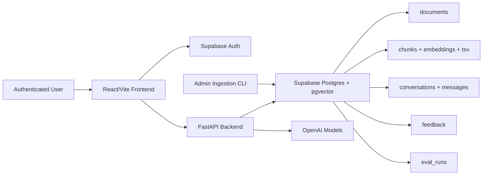

# Enterprise Knowledge Assistant - System Design

## High-Level Architecture

The Enterprise Knowledge Assistant is a production-shaped Retrieval Augmented Generation (RAG) application for answering questions from enterprise documents. It is deployed as three managed services:

- **Frontend:** React/Vite on Vercel
- **Backend:** FastAPI on Railway
- **Database/vector store:** Supabase Postgres with pgvector

The backend is stateless: all durable state lives in Supabase Postgres. This keeps the deployment simple and makes the API tier horizontally scalable. Postgres stores both traditional application data and vector-search data, avoiding a separate vector database for the assignment scale.

## Data Flow

### Ingestion Flow

1. The admin ingestion CLI loads the bundled sample corpus from `data/sample`, or a signed-in user uploads a document from the UI.
2. Supported formats are PDF, Markdown, TXT, and DOCX.
3. Each file is checksummed. If the same owner ingests the same file again, it is skipped instead of duplicated.
4. The loader extracts text while preserving page metadata where available.
5. The chunker creates page-aware, section-aware chunks. Chunks intentionally preserve citation metadata so answers can point back to exact pages/sections.
6. The embedding provider generates vectors in batches.
7. The backend stores document metadata, chunk text, full-text search data, and embeddings in Postgres.
8. Supabase pgvector indexes embeddings with `halfvec(3072)` and HNSW for efficient semantic retrieval.

### Answering Flow

1. The user asks a question in the frontend.
2. The frontend sends `POST /ask` with the Supabase access token.
3. The backend verifies the JWT and computes the readable owner set:
   - `public-seed` shared sample corpus
   - current user's uploaded documents
4. Recent conversation history can rewrite follow-up questions into standalone search queries.
5. Retrieval runs in two channels:
   - dense semantic retrieval with pgvector
   - keyword retrieval with Postgres full-text search
6. Reciprocal Rank Fusion combines both rankings.
7. The utility model can rerank the strongest candidate chunks.
8. The generation model receives only retrieved evidence and must cite chunk IDs.
9. The backend returns the answer, compact citations, confidence, groundedness, citation count, status, and latency.
10. The frontend displays lightweight document-name citations. Clicking one opens an indexed-text artifact viewer and highlights the referenced chunk.

If retrieval evidence is weak or the model marks the answer unsupported, the API returns `status: "insufficient_context"` instead of generating a guessed answer.

## Component Explanation

### Frontend

The frontend is the first-screen assistant experience, not a landing page. It includes sign-in, document upload, document status, chat, compact citations, answer metrics, artifact viewing, loading/error states, and thumbs up/down feedback. Vite keeps the build simple for Vercel.

### Backend API

FastAPI exposes:

- `POST /ask` for grounded question answering
- `GET /documents` for indexed document status
- `GET /documents/{document_id}/artifact` for citation artifact viewing
- `POST /upload` for authenticated user uploads
- `POST /feedback` for answer feedback
- `GET /healthz` and `GET /readyz` for deployment checks
- `POST /ingest` for admin-protected sample corpus ingestion

The backend owns CORS, rate limiting, request validation, JWT verification, ingestion, retrieval, generation, and persistence.

### Retrieval And Generation

The retrieval strategy is intentionally hybrid. Dense search handles semantic similarity, while full-text search handles exact terms such as API names, policy names, product names, and numbers. Reciprocal Rank Fusion combines the rankings, and optional LLM reranking improves final evidence order.

Generation is grounded by design. The model is instructed to answer only from supplied chunks and cite chunk IDs. The backend maps those chunk IDs back to stored document metadata, so citations are not invented by the model.

### Evaluation

Offline evaluation uses labelled questions with expected answer snippets and gold source pages. The eval runner measures answer accuracy, document Recall@5, page Recall@5, MRR, abstention accuracy, and latency. Ablations compare dense-only retrieval, hybrid retrieval, and reranked retrieval.

Live answers do not show "correctness" because arbitrary uploaded documents do not have ground truth. Instead, the product shows evidence-derived metrics: confidence, groundedness, citation count, answer status, latency, and user feedback.

## Scalability Considerations

The current design is intentionally simple but production-shaped:

- **API scaling:** FastAPI is stateless, so Railway can run multiple replicas.
- **Data scaling:** Postgres owns durable state; pgvector HNSW supports efficient approximate nearest-neighbor search for small-to-medium corpora.
- **Security scaling:** Supabase Auth scopes user uploads by owner while keeping the sample corpus globally readable.
- **Indexing scaling:** Upload indexing currently uses FastAPI background tasks. At higher volume, this should move to a queue and worker.
- **Retrieval scaling:** If the corpus grows to millions of chunks, a dedicated vector database such as Qdrant, Pinecone, or Weaviate would be the next step.
- **Evaluation scaling:** User-provided labelled eval sets can be stored per owner and run as scheduled eval jobs.
- **Operational scaling:** Redis caching, token/cost metrics, latency dashboards, and feedback analytics should be added before heavy production usage.

This design avoids unnecessary complexity for the assignment while leaving clear extension points for a real enterprise deployment.
